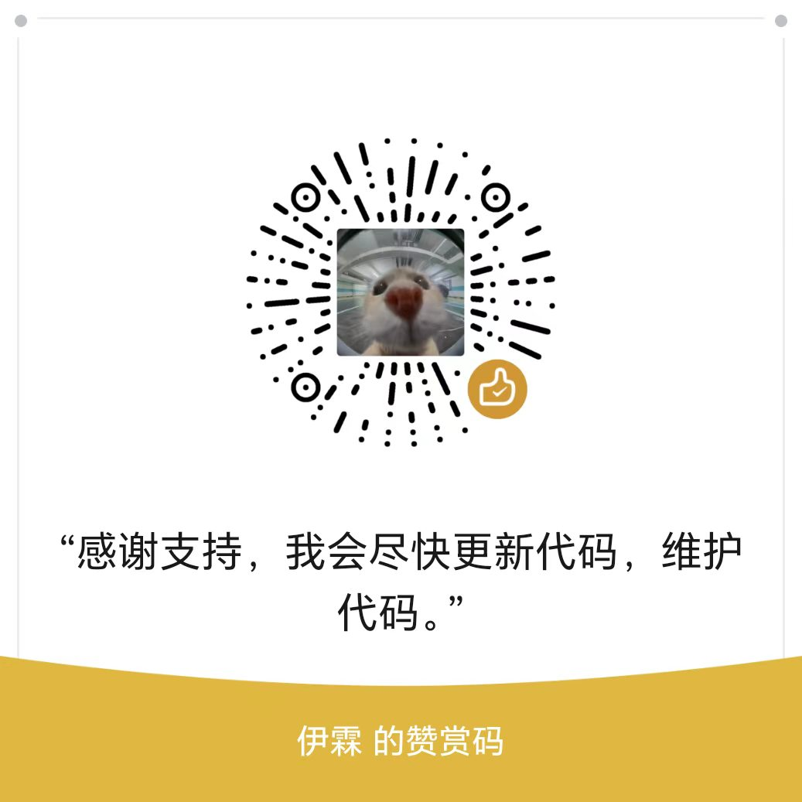

# hermes-pkos-skill 🧠

**A Personal Knowledge Operating System for AI Agents.**

> 还没有 AI 读过这份说明书？没关系，这个项目本身就是给 AI 看的说明书。
> 人类读者只需要记住一句话：**它帮你的 AI 把乱七八糟的资料，变成整整齐齐的知识，还能写出文章、画出漫画、做出幻灯片。**

[](https://github.com/liubarryteb12/hermes-pkos-skill/releases)
[]()
[]()
[]()
[]()

---

## 🍼 这个东西是干什么的？（五岁小孩版）

想象你有一个神奇的玩具箱 📦。

- 你把**任何东西**扔进去：网页文章、PDF 书、微信公众号链接、随手记的笔记……
- 一个勤劳的小机器人会把它们**擦干净、贴上标签、放到正确的格子里**。
- 你想知道任何东西在哪，问它一句话就能找到。
- 最好的部分：小机器人还能把箱子里的知识**变成礼物** 🎁——
  一篇公众号文章、一本漫画、一份 PPT、一个小说故事。

这个仓库就是**那个小机器人**。

它由 29 个小工人组成（我们叫它们"单元"）。每个工人只干一件事，干得又快又好。有的负责收快递，有的负责贴标签，有的负责当质检员。它们手拉手排成一条流水线，你的资料从一头进去，礼物从另一头出来。

---

## ✨ 它有什么特别的

| 特点 | 说的什么 |
|---|---|
| 🚪 **一扇门原则** | 全库只有一个文件被允许"写字"（commit）。就像家里只有一个门，谁都别想从窗户爬进来——所以你的知识库永远不会被搞乱 |
| 🔍 **边存边记** | 存一篇笔记的同一瞬间，搜索引擎、链接图、目录全部更新完毕。没有"重建索引"这个动作，因为它永远是最新的 |
| 🕵️ **六个侦探** | 六个"行为探针"日日夜夜测试小工人们有没有偷偷犯错。每个侦探都真的抓到过 bug——不是摆设 |
| 🚫 **只进不退** | 知识有状态：`raw → triaged → analyzed → polished → routed → exported → published`。想开倒车？门都没有（需要特殊审批+写检讨） |
| 🗑️ **温柔的垃圾桶** | 删除的东西先进 30 天缓冲区，到期还要人类点头才真删。AI 无权直接删除任何东西 |
| 🛡️ **防呆校验器** | 注册表（registry）有 fail-fast 校验：脏数据想进库？当场拒绝，绝不留情 |

---

## 🏭 流水线长什么样

```
你的资料 📄📄📄
    │
    ▼
┌─────────┐    ┌─────────┐    ┌──────────────┐
│ intake   │ →  │ ingest  │ →  │ commit 🔒    │   ← 入库（唯一的门）
│ 收快递   │    │ 拆快递   │    │ 登记+贴标签   │
└─────────┘    └─────────┘    └──────────────┘
                                      │
                                      ▼
┌─────────┐    ┌─────────┐    ┌──────────────┐
│ analysis │ →  │ polish  │ →  │ router 🧭    │   ← 出库（决定做什么）
│ 消化理解 │    │ 打磨干净 │    │ 挑选礼物方向  │
└─────────┘    └─────────┘    └──────────────┘
                                      │
        ┌──────────┬──────────┬───────┴────┬──────────┐
        ▼          ▼          ▼            ▼          ▼
    📝 公众号    🎨 漫画     📊 PPT      🌐 网页     📖 小说
```

旁边还有几个"保安"和"管家"：

- **operator** 🛡️ 保安：检查进来的 AI 有没有越权
- **meta/tick** ⏰ 管家：每天心跳巡检，发现堆积就报警
- **maintenance-index** 📇 图书管理员：维护总目录 MASTER_INDEX
- **trash-gc** 🗑️ 垃圾桶管理员：只管倒垃圾申请，真倒要人类签字

---

## 🚀 快速开始

### 你需要

- Windows 10/11（其他系统未测试，理论上 Python 部分可跑）
- Python 3.11+
- 一个 Obsidian 仓库（vault）——它管理的就是这个文件夹

### 安装（给 Hermes Agent 用户）

```bash
# 1. 克隆到 Hermes 技能目录
cd "$env:LOCALAPPDATA\hermes\skills\note-taking"
git clone https://github.com/liubarryteb12/hermes-pkos-skill.git

# 2. 体检：确认小工人们都到岗了
cd hermes-pkos-skill
python scripts/upgrade_check.py     # 应输出 ALL PASS
python scripts/registry_schema_check.py   # 应输出 PASS (29 单元, 0 警告)
```

### 第一次使用（告诉你的 AI）

对 AI 说人话就行：

| 你说 | AI 做 |
|---|---|
| "整理一下我的知识库" | 走 INBOX 消化主线：收快递 → 拆 → 入库，分批干完报进度 |
| "给知识库做个体检" | 只读测量：多少条、多健康、哪里生病，不改任何文件 |
| "把这份资料入库" | 单篇走 intake → ingest → commit |
| "把这个主题写成公众号文章" | 查库 → 分析 → 润色 → 弱审 → 出稿 |

### 日常维护（可以做成定时任务）

```bash
# 体检（全部只读，跑不坏）
python 21-pkos-meta/scripts/tick.py --json              # 心跳巡检
python 17-pkos-audit-lint/scripts/lint.py --vault "你的库路径" --mode report-only
python 16-pkos-maintenance-index/scripts/index.py --vault "你的库路径" --json
python 04-pkos-knowledge-service-commit/scripts/verify_after.py   # 引擎终检

# 垃圾桶报告（绝不直接删）
python 04-pkos-knowledge-service-commit/scripts/trash_gc.py --report
```

---

## 🧩 32 个小工人花名册

### 入线（收快递的）
| 单元 | 干什么 |
|---|---|
| `intake.scan`（`01-pkos-intake`） | 看一眼快递单，判断这是什么、该送给谁 |
| `intake.query`（`09-pkos-intake-query`） | 你问"库里有没有关于 X 的"，它去翻 |
| `ingest.extract`（`03-pkos-ingest`） | 拆快递：网页/PDF/笔记 → 合规条目 |
| `distill.book`（`02-pkos-distill-book`） | 整本 PDF 拆成一章一章的知识卡 |

### 大门（登记处）
| 单元 | 干什么 |
|---|---|
| `knowledge_service.commit`（`04-…-commit`）🔒 | 🔒 **唯一写入口**。校验、贴标签、写索引、留审计，全在这一步 |

### 出线（做礼物的）
| 单元 | 干什么 |
|---|---|
| `analysis.structure`（`05-pkos-analysis`） | 读懂一篇：一句话概述 + 核心要点 + 发现表 |
| `polish.refine`（`06-pkos-polish`） | 去掉 AI 味，给文本洗澡，附带五维评分 |
| `weak_check.verify`（`07-pkos-weak-check`） | 质检员：打分不够的稿子退回重写 |
| `router.decide`（`08-pkos-router`） | 司机：决定这份稿子去哪个出口 |
| `exit.wenzhang`（`13-pkos-wenzhang-skill`） | 公众号文章成稿（文案+排版双产物） |
| `exit.html.render`（`10-pkos-html`） | 单文件离线网页 |
| `exit.ppt.compose`（`11-pkos-ppt-skill`） | 原生可编辑 PPT（5 种主题，fail-loud 不静默降级） |
| `exit.comic.compose`（`12-pkos-comic`） | 漫画分镜 + 出图编排 |
| `exit.gzhxiaoshuo`（`14-pkos-gzhxiaoshuo-skill`） | 小说章节 |

### 管家团（让一切保持整洁）
| 单元 | 干什么 |
|---|---|
| `maintenance.index`（`16-pkos-maintenance-index`） | 总目录双产物（人读 md + 机读 json） |
| `audit.lint`（`17-pkos-audit-lint`） | 全库体检医生（默认只报告不动手） |
| `fanout.concept`（`18-pkos-fanout-concept`） | 一个概念吹成 6 个方向的选题 |
| `maintenance.timeline`（`19-pkos-timeline`） | 库的成长时间线 |
| `governance.bootstrap`（`00-pkos-init`） | 初始化新库的地基 |
| `governance.audit`（`20-pkos-audit`） | 深度审计 + 盲点检测 |
| `governance.tick`（`21-pkos-meta`） | 每日心跳 |
| `publish.draft`（`15-pkos-publish`） | 发表枢纽：上传→回读→验证 闭环 |
| `operator.audit`（`22-pkos-operator`） | 调用方人格守卫（Meta-Auditor） |
| `skillopt.train`（`23-pkos-skillopt`） | 用真实任务集训练/优化技能本身 |
| `gemini.chat / image / video` | 外脑：对话、生图、生视频 |
| `gptimage2use`（`27-pkos-gptimage2use`） | 原子出图通道（只吃现成题词，不产题词） |

### 运营与题词（v5.4 新车间）
| 单元 | 干什么 |
|---|---|
| `trend.collect`（`29-pkos-trend`） | 免费渠道抓热点信号，产情报单 |
| `topic.generate`（`28-pkos-topic`） | 产品经理式选题：母题规划+候选标题组 |
| `scorecard.judge`（`30-pkos-scorecard`） | 成稿六维评分门：机械项脚本算，REJECT 真拦人 |
| `imageprompt.compose`（`31-pkos-imageprompt`） | ⭐ 全体系出图文案唯一输出中心（320 条题词库+安全层） |

---

## 🔬 给较真的你：质量是怎么保证的

这套系统经历过一轮**外部对抗评审**（另一个 AI 实例当评审方，发了六份行为契约工单）。
核心方法论：**契约工单 → 行为探针 → 固化回归**。翻译成人话：

1. 评审方说"你必须做到这 12 条行为"
2. 我们写成自动化探针（比如 `probe_links.py`，12 条断言）
3. 探针失败时，第一反应是"实现有问题"而不是"测试有问题"
4. 探针固化进回归测试，永不删除

### 六个常驻探针（全部固化进 pytest 回归）

| 探针 | 断言数 | 抓到过的真 bug |
|---|---|---|
| `probe_thread` | 9 | 零容忍策略无强制 |
| `probe_frontmatter` | 20 | str/bytes 混用、BOM、空值键、八进制陷阱 |
| `probe_links` | 12 | 两阶段提交三个失败窗口只测了一个 |
| `probe_concurrency` | 7 | 并发写 hash 错位、full_scan 误删 |
| `probe_p2` | 14 | 锁 use-after-expire（过期锁被人误删） |
| `probe_trash_gc` | 11 | junction 穿透风险 |

### 测试基线（2026-09-04，全部实测）

```
pkos_kb pytest    158 passed, 1 skipped   ← 六探针固化回归
run_tests         19/19                   ← 词表/状态机/校验全项
capability_runner 37/37, 0 skip           ← 能力契约（曾经 4 个跳过，已全部转真断言）
router_matrix     43/43                   ← 路由合法/非法/风格
upgrade_check     ALL PASS                ← 五维升级守卫 + schema 校验
```

### 已知短板（不藏着）

- 性能绝对规格未达标：本机比参考容器慢 ~10-21 倍（Windows Defender 实时扫描所致），测试按倍率放宽了，**没有假装达标**
- 硬墙沙箱（Windows 受限令牌）默认关闭——需要系统级 Python 才能启用
- `gemini.video` 曾长期是骨架占位，现已转正但实战较少
- 单元职责边界偶尔被挑战，每次都靠结构审计（structure-audit）裁决

---

**输出自检钩子（v5.4.3）**：6 个纯提示词单元（分析/润色/问答/扇出/热点/题词）落盘前必须过 `qa_check.py`
机械自检——结构完整性、编号连续性、占位符、S00 安全词全由脚本判，FAIL 拒绝落盘。模型智力波动只影响
写得好不好，影响不了合不合格。

## 📐 设计原则（三层体系观）

```
单元 Unit    = 只做一件事的小工人（独立维护、独立进化）
工作流 Flow  = 小工人手拉手的主线（intake→…→exit）
枢纽 Hub     = 少数几个大门（commit / router / publish / operator·meta）
```

**铁律：禁止一个工人抢另一个工人的活。** 跨领域的共享能力必须抽成独立枢纽。
每次新增单元前过"结构审计"五问，同输入同输出同时间的重叠对 = 0 才准入。

数据安全三原则：

1. **vault 物理只读**：AI 无删除权、无改名权；唯一写入口是 commit
2. **删除三步走**：进 `_trash/<日期>/` → 30 天 → 人类确权 → 才真删
3. **fail-loud**：出错就大声报错，绝不静默吞掉（静默的失败比失败更可怕）

---

## 🗺️ 仓库结构

```
hermes-pkos-skill/
├── SKILL.md                  ← AI 的入口说明书（触发词+调度）
├── pipeline/registry.json    ← 单元注册表（29 units · pkos_semver=版本 SSOT）
├── contracts/                ← 权威契约（词表/路由/通道政策/失败分类）
├── 00-pkos-init … 27-pkos-*  ← 29 个单元（目录序号 00-27 连续=流水线阶段）
├── 04-pkos-knowledge-service-commit/
│   └── scripts/
│       ├── pkos_kb/          ← 知识库引擎（SQLite WAL 单写者）
│       ├── pkos_kb_tests/    ← 158 项回归 + 6 探针固化
│       ├── probe_*.py        ← 独立探针（可单独跑）
│       └── trash_gc.py       ← 垃圾桶管理员
├── scripts/                  ← upgrade_check / schema 校验 / sync_to_main
├── tests/                    ← run_tests / contract_refs / capability_runner
└── references/               ← unit-map 速查表 / 词表 / 升级计划
```

---

## 🔢 版本体系（单一事实源）

`pipeline/registry.json` 的 `pkos_semver` 是**唯一版本号来源**。
`manifest.json` / `VERSION` / `SKILL.md` 都只是它的只读投影——
`python scripts/version_sync.py --check` 校验一致性（已进 upgrade_check 门禁，漂移即 FAIL）。

### 发版流程

```bash
# 1. 改代码，改完 bump registry.pkos_semver
# 2. 同步投影 + 校验
python scripts/version_sync.py --apply && python scripts/version_sync.py --check
# 3. 规范 commit（Conventional Commits: feat|fix|refactor|docs|chore|test(scope): 摘要）
# 4. tag + GitHub Release（notes = changelog 最新条目）
5. **更新 README**：徽章数字（units/tests）、花名册新单元、新特性段落——README 跟着每次发版走，不许留旧数
```

**从 v4.x 升级到 v5.0.0**：单元目录已全部改为 `<序号>-pkos-<功能>` 命名，
旧→新对照表见 [docs/MIGRATION-5.0.md](docs/MIGRATION-5.0.md)。`capability_id` 与脚本 CLI 参数均未变。

---

## 🤝 给想抄作业的你

这个项目欢迎被"仿照"。最值得偷的三样东西：

1. **探针方法论**——`pkos_kb_tests/test_*_contract.py` 六个文件，行为契约测试的最小可行样本
2. **Fail-fast schema 校验器**——`scripts/registry_schema_check.py`，58 行防住所有脏数据
3. **forward-only 状态机**——`pkos_kb/catalog.py` 里的状态推进+拒绝回退

它们都小到可以一眼看完，大到能守住整个系统。

## 📄 License

MIT —— 拿去用，改完记得回来留个 star ⭐

## ❤️ 赞助

如果这个项目帮到了你，可以请作者（伊霖）喝杯咖啡 ☕

<p align="center">
  
</p>
<p align="center"><i>微信赞赏 · 扫码请作者喝杯咖啡</i></p>

---

<div align="center">

**一个由 AI 构建、AI 评审、AI 维护的知识操作系统。**
**人类只负责一件事：决定什么是重要的。**

</div>
